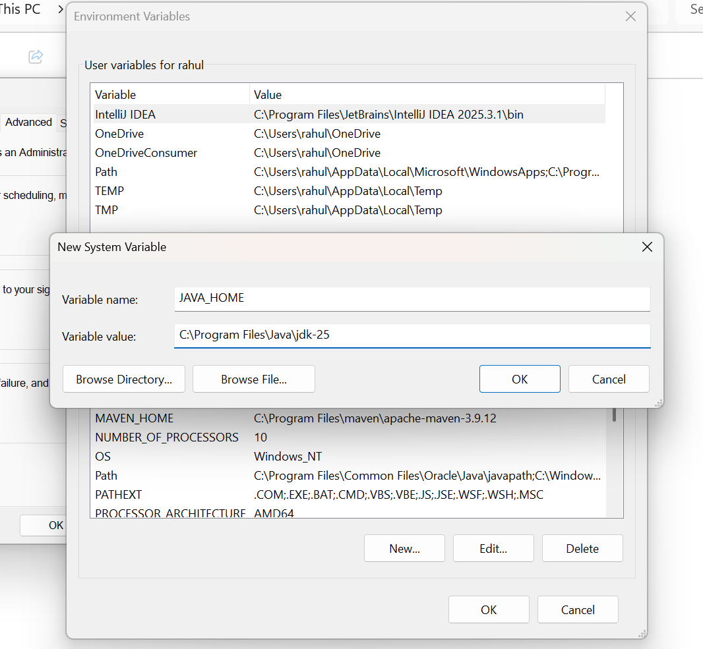
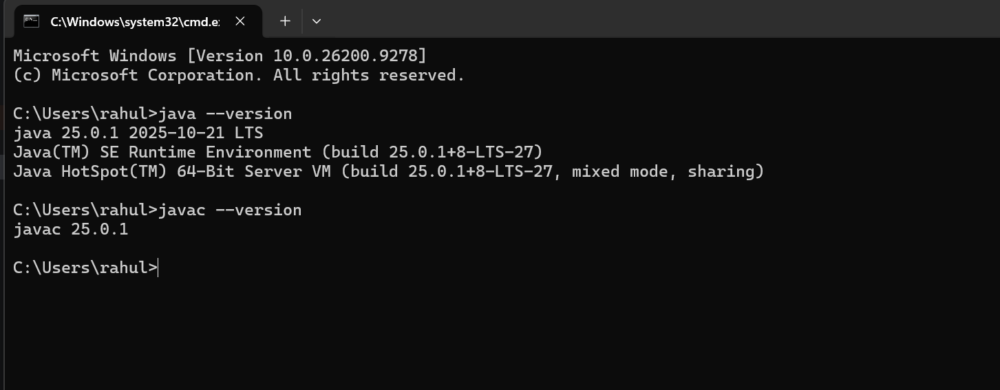
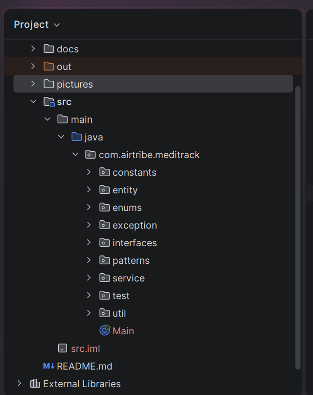
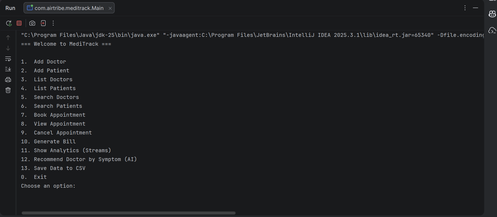
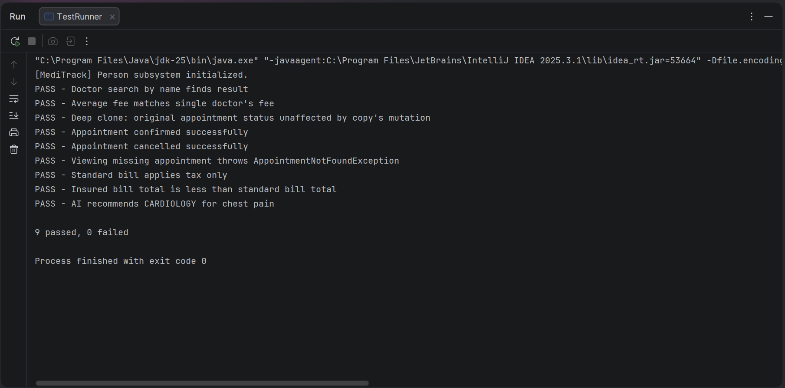
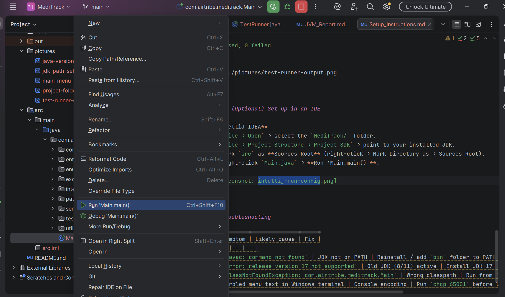

# Setup Instructions — MediTrack

These steps cover installing Java (JDK), verifying the install, and running
the MediTrack console application from source.

---

## 1. Install the JDK

MediTrack uses Java 25 language features (records-style text blocks,
switch expressions), so install **JDK 25 or newer**.

### Windows
1. Download the installer from [https://www.oracle.com/in/java/technologies/downloads/#jdk25-windows](https://adoptium.net/) (choose JDK 25, Windows x64 `.msi`).
2. Run the installer, keeping the default options, including "Set JAVA_HOME variable" and "Add to PATH".
   
3. Finish the install and close the installer.

## 2. Verify the install

Open a terminal / command prompt and run:

```bash
java -version
javac -version
```

You should see output similar to:

```
java 25.0.1 2025-10-21 LTS
Java(TM) SE Runtime Environment (build 25.0.1+8-LTS-27)
Java HotSpot(TM) 64-Bit Server VM (build 25.0.1+8-LTS-27, mixed mode, sharing)
javac 25.0.1
```



If `java`/`javac` are "not recognized" or "not found," the JDK's `bin`
folder isn't on your PATH — re-run the installer and confirm the
"Add to PATH" option, or add it manually to your shell profile
(`~/.bashrc`, `~/.zshrc`, or Windows Environment Variables).

---

## 3. Get the project

Clone the repo `https://github.com/rahul7352/MediTrack.git`, so you have:

```
MediTrack/
├── docs/
└── src/main/java/com/airtribe/meditrack/...
```



---

## 4. Compile

From the `MediTrack/` root directory:

```bash
find src -name "*.java" > sources.txt
javac -d bin @sources.txt
```

This compiles every `.java` file under `src/` into class files under `bin/`.
A clean compile produces no output at all.

---

## 5. Run

### Run the interactive console app
```bash
java -cp bin com.airtribe.meditrack.Main
```



### Run with persisted data loaded from CSV
```bash
java -cp bin com.airtribe.meditrack.Main --loadData
```

### Run the manual test suite
```bash
java -cp bin com.airtribe.meditrack.test.TestRunner
```

Expected output ends with a summary line, e.g.:
```
9 passed, 0 failed
```



---

## 6. (Optional) Set up in an IDE

**IntelliJ IDEA**
1. `File → Open` → select the `MediTrack/` folder.
2. `File → Project Structure → Project SDK` → point to your installed JDK.
3. Mark `src` as **Sources Root** (right-click → Mark Directory as → Sources Root).
4. Right-click `Main.java` → **Run 'Main.main()'**.



---

## Troubleshooting

| Symptom | Likely cause | Fix                                                        |
|---|---|------------------------------------------------------------|
| `javac: command not found` | JDK not on PATH | Reinstall / add `bin` folder to PATH                       |
| `error: release version 17 not supported` | Old JDK (8/11) active | Install JDK 17+ and point `JAVA_HOME` at it                |
| `ClassNotFoundException: com.airtribe.meditrack.Main` | Wrong classpath | Run from `MediTrack/` root with `-cp bin`                  |
| Garbled menu text in Windows terminal | Console encoding | Run `chcp 65001` before launching, or use Windows Terminal |
